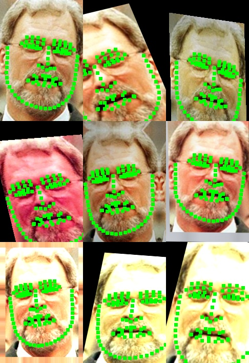

# Data-Augumentation-4-Image

- augumentation tool for landmarks



- Todo:
    1.augumentation tool for bbox


## How to use
modify ```config.py```
```
train_landmarks_path = '/home/lnan95/data/WFLW_images/WFLW_annotations/list_98pt_rect_attr_train_test/list_98pt_rect_attr_train.txt'
test_landmarks_path = '/home/lnan95/data/WFLW_images/WFLW_annotations/list_98pt_rect_attr_train_test/list_98pt_rect_attr_test.txt'
img_path= '/home/lnan95/data/WFLW_images/WFLW_images'

train_path_for_save = 'data/train_img'
test_path_for_save = 'data/test_img'
landmark_path_for_save = 'data/landmark.txt'
```